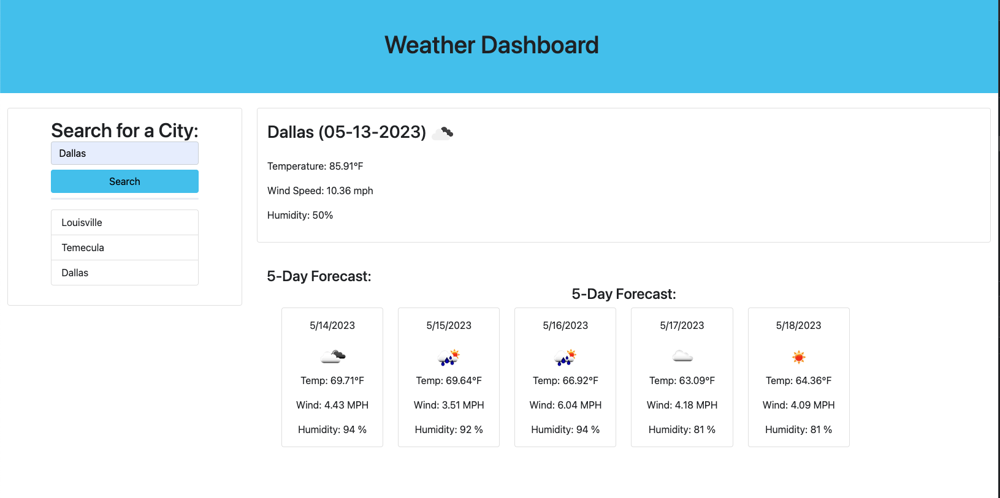

# Weather Dashboard

  

  ## Description
  This is a simple weather app that allows the user to search a city and display the weather data. The app will save the users search history and allow the user to recall the weather data from their history as well.

  ## Table of Contents
  * [Installation](#installation)
  * [Usage](#usage)
  * [Credits](#credits)
  * [License](#license)
  * [How to Contribute](#how-to-contribute)
  * [Tests](#tests)
  * [Questions](#questions)
  
  ## Installation
  N/A

  ## Usage
  Enter a city name into the input box to display the current weather and five day forecast data. Click on a city name link, from the list under the search button, to get the weather data for a previously searched city.

  

  ## Credits
  N/A

  ## License
    This app is licensed under the MIT license.

  ## How to Contribute
  N/A

  ## Tests
  N/A

  ## Questions
  Questions about this app?  
  GitHub: https://github.com/shale00  
